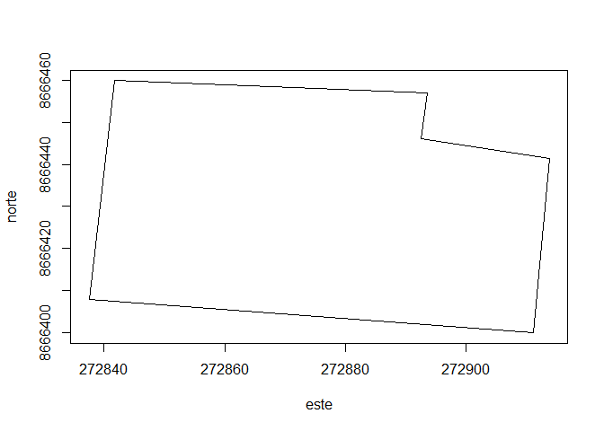

Parcial de Programación
================
Christian Gabriel Bernedo Garcia
10/12/2021

## Parte 1

### 1. Crear una funci ́on que permita calcular el ́angulo entre las rectas L1 y L2 teniendo sus pendientes como par ́ametros. La funci ́on debe considerar si estas rectas no se cruzan.

``` r
angulo= function(m1,m2) {
 atan(m2-m1)/(1+m1*m2)
}
# ejemplo
angulo(1,1/3)
```

    ## [1] -0.441002

### 2. Crear una funci ́on que grafique un pol ́ıgono ingresando un dataframe con sus coordenadas este y norte como par ́ametros. La funci ́on debe aceptar dataframes con un m ́aximo de 50 registros, realizar la prueba con las siguientes coordenadas.

``` r
cod<-c("A","B","C","D","E","F")
este<-c(272841.7,272893.6,272892.5,272913.8,272911.2,272837.5)
norte<-c(8666459.9,8666456.9,8666446.1,8666441.5,8666399.9,8666407.9)
df<-data.frame(cod,este,norte)

polig<-function(df){
  este<-c(df[,"este"],df[1,2])
  norte<-c(df[,"norte"],df[1,3])
  return(plot(este,norte,type="l"))
}
polig(df)
```

<!-- -->

## Parte 2

### 1. El dataset kc house data tiene informaci ́on de ventas de viviendas entre mayo del 2014 y 2015 en el condado de King, estado de Washington, EEUU. Esta base es empleada es bastante utilizada para ejercicios deregresi ́on. La columna price tiene los precios de las viviendas y las dem ́as son caracter ́ısticas de las casas en venta.

#### ∗ Realizar un an ́alisis e interpretaci ́on de los datos de los precios de las casas. Se puede realizar gr ́aficos y calcular estad ́ısticos.

#### ∗ (Adicional) Realizar un modelo de regresi ́on para predecir cu ́al es la combinaci ́on de variables para predecir el precio.

### 2. A partir del siguiente

### 3. Leer el dataset de frutas dataset-fruits.csv realizar lo siguiente

``` r
paises=read.csv("C:/Users/gabriel/Downloads/dataset-fruits.csv")
paises
```

    ##     ï.._id paisorigen_id   pais_origen producto paisdestino_id pais_destino
    ## 1        1           210       Ecuador   Banana             32    Argentina
    ## 2        2           202       Bolivia   Banana             32    Argentina
    ## 3        3           221      Paraguay   Banana             32    Argentina
    ## 4        4           203        Brasil   Banana             32    Argentina
    ## 5        5            NA         Otros   Banana             32    Argentina
    ## 6        6           210       Ecuador   Banana             32    Argentina
    ## 7        7           202       Bolivia   Banana             32    Argentina
    ## 8        8           221      Paraguay   Banana             32    Argentina
    ## 9        9           203        Brasil   Banana             32    Argentina
    ## 10      10            NA         Otros   Banana             32    Argentina
    ## 11      11           210       Ecuador   Banana             32    Argentina
    ## 12      12           202       Bolivia   Banana             32    Argentina
    ## 13      13           221      Paraguay   Banana             32    Argentina
    ## 14      14           203        Brasil   Banana             32    Argentina
    ## 15      15            NA         Otros   Banana             32    Argentina
    ## 16      16           210       Ecuador   Banana             32    Argentina
    ## 17      17           202       Bolivia   Banana             32    Argentina
    ## 18      18           221      Paraguay   Banana             32    Argentina
    ## 19      19           203        Brasil   Banana             32    Argentina
    ## 20      20            NA         Otros   Banana             32    Argentina
    ## 21      21           210       Ecuador   Banana             32    Argentina
    ## 22      22           202       Bolivia   Banana             32    Argentina
    ## 23      23           221      Paraguay   Banana             32    Argentina
    ## 24      24           203        Brasil   Banana             32    Argentina
    ## 25      25            NA         Otros   Banana             32    Argentina
    ## 26      26           210       Ecuador   Ananá             32    Argentina
    ## 27      27           203        Brasil   Ananá             32    Argentina
    ## 28      28           221      Paraguay   Ananá             32    Argentina
    ## 29      29           202       Bolivia   Ananá             32    Argentina
    ## 30      30           206    Costa Rica   Ananá             32    Argentina
    ## 31      31            NA         Otros   Ananá             32    Argentina
    ## 32      32           210       Ecuador   Ananá             32    Argentina
    ## 33      33           203        Brasil   Ananá             32    Argentina
    ## 34      34           221      Paraguay   Ananá             32    Argentina
    ## 35      35           202       Bolivia   Ananá             32    Argentina
    ## 36      36           206    Costa Rica   Ananá             32    Argentina
    ## 37      37            NA         Otros   Ananá             32    Argentina
    ## 38      38           210       Ecuador   Ananá             32    Argentina
    ## 39      39           203        Brasil   Ananá             32    Argentina
    ## 40      40           221      Paraguay   Ananá             32    Argentina
    ## 41      41           202       Bolivia   Ananá             32    Argentina
    ## 42      42           206    Costa Rica   Ananá             32    Argentina
    ## 43      43            NA         Otros   Ananá             32    Argentina
    ## 44      44           210       Ecuador   Ananá             32    Argentina
    ## 45      45           203        Brasil   Ananá             32    Argentina
    ## 46      46           221      Paraguay   Ananá             32    Argentina
    ## 47      47           202       Bolivia   Ananá             32    Argentina
    ## 48      48           206    Costa Rica   Ananá             32    Argentina
    ## 49      49            NA         Otros   Ananá             32    Argentina
    ## 50      50           210       Ecuador   Ananá             32    Argentina
    ## 51      51           203        Brasil   Ananá             32    Argentina
    ## 52      52           221      Paraguay   Ananá             32    Argentina
    ## 53      53           202       Bolivia   Ananá             32    Argentina
    ## 54      54           206    Costa Rica   Ananá             32    Argentina
    ## 55      55            NA         Otros   Ananá             32    Argentina
    ## 56      56           203        Brasil    Mango             32    Argentina
    ## 57      57           210       Ecuador    Mango             32    Argentina
    ## 58      58            NA         Otros    Mango             32    Argentina
    ## 59      59           203        Brasil    Mango             32    Argentina
    ## 60      60           210       Ecuador    Mango             32    Argentina
    ## 61      61            NA         Otros    Mango             32    Argentina
    ## 62      62           203        Brasil    Mango             32    Argentina
    ## 63      63           210       Ecuador    Mango             32    Argentina
    ## 64      64            NA         Otros    Mango             32    Argentina
    ## 65      65           203        Brasil    Mango             32    Argentina
    ## 66      66           210       Ecuador    Mango             32    Argentina
    ## 67      67            NA         Otros    Mango             32    Argentina
    ## 68      68           203        Brasil    Mango             32    Argentina
    ## 69      69           210       Ecuador    Mango             32    Argentina
    ## 70      70            NA         Otros    Mango             32    Argentina
    ## 71      71           208         Chile     Kiwi             32    Argentina
    ## 72      72           417        Italia     Kiwi             32    Argentina
    ## 73      73           504 Nueva Zelanda     Kiwi             32    Argentina
    ## 74      74            NA         Otros     Kiwi             32    Argentina
    ## 75      75           208         Chile     Kiwi             32    Argentina
    ## 76      76           417        Italia     Kiwi             32    Argentina
    ## 77      77           504 Nueva Zelanda     Kiwi             32    Argentina
    ## 78      78            NA         Otros     Kiwi             32    Argentina
    ## 79      79           208         Chile     Kiwi             32    Argentina
    ## 80      80           417        Italia     Kiwi             32    Argentina
    ## 81      81           504 Nueva Zelanda     Kiwi             32    Argentina
    ## 82      82            NA         Otros     Kiwi             32    Argentina
    ## 83      83           208         Chile     Kiwi             32    Argentina
    ## 84      84           417        Italia     Kiwi             32    Argentina
    ## 85      85           504 Nueva Zelanda     Kiwi             32    Argentina
    ## 86      86            NA         Otros     Kiwi             32    Argentina
    ## 87      87           208         Chile     Kiwi             32    Argentina
    ## 88      88           417        Italia     Kiwi             32    Argentina
    ## 89      89           504 Nueva Zelanda     Kiwi             32    Argentina
    ## 90      90            NA         Otros     Kiwi             32    Argentina
    ## 91      91           208         Chile    Palta             32    Argentina
    ## 92      92           218       México    Palta             32    Argentina
    ## 93      93           222         Perú    Palta             32    Argentina
    ## 94      94            NA         Otros    Palta             32    Argentina
    ## 95      95           208         Chile    Palta             32    Argentina
    ## 96      96           218       México    Palta             32    Argentina
    ## 97      97           222         Perú    Palta             32    Argentina
    ## 98      98            NA         Otros    Palta             32    Argentina
    ## 99      99           208         Chile    Palta             32    Argentina
    ## 100    100           218       México    Palta             32    Argentina
    ## 101    101           222         Perú    Palta             32    Argentina
    ## 102    102            NA         Otros    Palta             32    Argentina
    ## 103    103           208         Chile    Palta             32    Argentina
    ## 104    104           218       México    Palta             32    Argentina
    ## 105    105           222         Perú    Palta             32    Argentina
    ## 106    106            NA         Otros    Palta             32    Argentina
    ## 107    107           208         Chile    Palta             32    Argentina
    ## 108    108           218       México    Palta             32    Argentina
    ## 109    109           222         Perú    Palta             32    Argentina
    ## 110    110            NA         Otros    Palta             32    Argentina
    ##     aÃ.o moneda_cod  moneda   totales
    ## 1   2013        USD Dolares 151963.47
    ## 2   2013        USD Dolares  30271.17
    ## 3   2013        USD Dolares   4802.20
    ## 4   2013        USD Dolares   4765.58
    ## 5   2013        USD Dolares      0.00
    ## 6   2014        USD Dolares 162352.90
    ## 7   2014        USD Dolares  37248.63
    ## 8   2014        USD Dolares   6372.06
    ## 9   2014        USD Dolares   7660.75
    ## 10  2014        USD Dolares      0.00
    ## 11  2015        USD Dolares 156409.67
    ## 12  2015        USD Dolares  41815.06
    ## 13  2015        USD Dolares   8847.91
    ## 14  2015        USD Dolares   7907.47
    ## 15  2015        USD Dolares      0.00
    ## 16  2016        USD Dolares 156873.56
    ## 17  2016        USD Dolares  38354.46
    ## 18  2016        USD Dolares   9137.90
    ## 19  2016        USD Dolares   4797.27
    ## 20  2016        USD Dolares     14.56
    ## 21  2017        USD Dolares 188401.45
    ## 22  2017        USD Dolares  37432.23
    ## 23  2017        USD Dolares   8876.43
    ## 24  2017        USD Dolares   4177.66
    ## 25  2017        USD Dolares        NA
    ## 26  2013        USD Dolares   5825.50
    ## 27  2013        USD Dolares    602.36
    ## 28  2013        USD Dolares    774.47
    ## 29  2013        USD Dolares    437.76
    ## 30  2013        USD Dolares     88.13
    ## 31  2013        USD Dolares   5825.50
    ## 32  2014        USD Dolares   6101.07
    ## 33  2014        USD Dolares    942.50
    ## 34  2014        USD Dolares   1042.22
    ## 35  2014        USD Dolares    482.37
    ## 36  2014        USD Dolares      0.00
    ## 37  2014        USD Dolares   6101.07
    ## 38  2015        USD Dolares   5952.36
    ## 39  2015        USD Dolares    885.80
    ## 40  2015        USD Dolares    803.41
    ## 41  2015        USD Dolares    623.25
    ## 42  2015        USD Dolares      0.00
    ## 43  2015        USD Dolares   5952.36
    ## 44  2016        USD Dolares   6361.72
    ## 45  2016        USD Dolares   1269.51
    ## 46  2016        USD Dolares   1142.32
    ## 47  2016        USD Dolares    360.18
    ## 48  2016        USD Dolares      0.00
    ## 49  2016        USD Dolares   6361.72
    ## 50  2017        USD Dolares   8085.51
    ## 51  2017        USD Dolares   1778.53
    ## 52  2017        USD Dolares    898.80
    ## 53  2017        USD Dolares    157.89
    ## 54  2017        USD Dolares    200.94
    ## 55  2017        USD Dolares   8085.51
    ## 56  2013        USD Dolares   2005.83
    ## 57  2013        USD Dolares    275.18
    ## 58  2013        USD Dolares      0.00
    ## 59  2014        USD Dolares   2152.45
    ## 60  2014        USD Dolares    144.23
    ## 61  2014        USD Dolares      0.00
    ## 62  2015        USD Dolares   2189.14
    ## 63  2015        USD Dolares     85.50
    ## 64  2015        USD Dolares      0.00
    ## 65  2016        USD Dolares   2219.05
    ## 66  2016        USD Dolares     55.84
    ## 67  2016        USD Dolares      0.00
    ## 68  2017        USD Dolares   2749.70
    ## 69  2017        USD Dolares     28.79
    ## 70  2017        USD Dolares      0.00
    ## 71  2013        USD Dolares  11316.54
    ## 72  2013        USD Dolares   4159.50
    ## 73  2013        USD Dolares        NA
    ## 74  2013        USD Dolares     58.67
    ## 75  2014        USD Dolares   4611.40
    ## 76  2014        USD Dolares   5022.60
    ## 77  2014        USD Dolares     47.58
    ## 78  2014        USD Dolares      0.00
    ## 79  2015        USD Dolares  11277.40
    ## 80  2015        USD Dolares   4482.19
    ## 81  2015        USD Dolares        NA
    ## 82  2015        USD Dolares      0.00
    ## 83  2016        USD Dolares   7916.80
    ## 84  2016        USD Dolares   6091.73
    ## 85  2016        USD Dolares    215.61
    ## 86  2016        USD Dolares      0.00
    ## 87  2017        USD Dolares   9520.45
    ## 88  2017        USD Dolares   7825.25
    ## 89  2017        USD Dolares    217.24
    ## 90  2017        USD Dolares        NA
    ## 91  2013        USD Dolares  17692.93
    ## 92  2013        USD Dolares      0.00
    ## 93  2013        USD Dolares      0.00
    ## 94  2013        USD Dolares      0.00
    ## 95  2014        USD Dolares  25466.34
    ## 96  2014        USD Dolares      0.00
    ## 97  2014        USD Dolares      0.00
    ## 98  2014        USD Dolares      0.00
    ## 99  2015        USD Dolares  25322.14
    ## 100 2015        USD Dolares      0.00
    ## 101 2015        USD Dolares      0.00
    ## 102 2015        USD Dolares      0.00
    ## 103 2016        USD Dolares  24510.68
    ## 104 2016        USD Dolares    760.45
    ## 105 2016        USD Dolares      0.00
    ## 106 2016        USD Dolares      0.00
    ## 107 2017        USD Dolares  40222.21
    ## 108 2017        USD Dolares   1386.43
    ## 109 2017        USD Dolares   1619.81
    ## 110 2017        USD Dolares      0.00

#### (a) Eliminar la columna id 1

``` r
paises$ï.._id=NULL
paises
```

    ##     paisorigen_id   pais_origen producto paisdestino_id pais_destino aÃ.o
    ## 1             210       Ecuador   Banana             32    Argentina 2013
    ## 2             202       Bolivia   Banana             32    Argentina 2013
    ## 3             221      Paraguay   Banana             32    Argentina 2013
    ## 4             203        Brasil   Banana             32    Argentina 2013
    ## 5              NA         Otros   Banana             32    Argentina 2013
    ## 6             210       Ecuador   Banana             32    Argentina 2014
    ## 7             202       Bolivia   Banana             32    Argentina 2014
    ## 8             221      Paraguay   Banana             32    Argentina 2014
    ## 9             203        Brasil   Banana             32    Argentina 2014
    ## 10             NA         Otros   Banana             32    Argentina 2014
    ## 11            210       Ecuador   Banana             32    Argentina 2015
    ## 12            202       Bolivia   Banana             32    Argentina 2015
    ## 13            221      Paraguay   Banana             32    Argentina 2015
    ## 14            203        Brasil   Banana             32    Argentina 2015
    ## 15             NA         Otros   Banana             32    Argentina 2015
    ## 16            210       Ecuador   Banana             32    Argentina 2016
    ## 17            202       Bolivia   Banana             32    Argentina 2016
    ## 18            221      Paraguay   Banana             32    Argentina 2016
    ## 19            203        Brasil   Banana             32    Argentina 2016
    ## 20             NA         Otros   Banana             32    Argentina 2016
    ## 21            210       Ecuador   Banana             32    Argentina 2017
    ## 22            202       Bolivia   Banana             32    Argentina 2017
    ## 23            221      Paraguay   Banana             32    Argentina 2017
    ## 24            203        Brasil   Banana             32    Argentina 2017
    ## 25             NA         Otros   Banana             32    Argentina 2017
    ## 26            210       Ecuador   Ananá             32    Argentina 2013
    ## 27            203        Brasil   Ananá             32    Argentina 2013
    ## 28            221      Paraguay   Ananá             32    Argentina 2013
    ## 29            202       Bolivia   Ananá             32    Argentina 2013
    ## 30            206    Costa Rica   Ananá             32    Argentina 2013
    ## 31             NA         Otros   Ananá             32    Argentina 2013
    ## 32            210       Ecuador   Ananá             32    Argentina 2014
    ## 33            203        Brasil   Ananá             32    Argentina 2014
    ## 34            221      Paraguay   Ananá             32    Argentina 2014
    ## 35            202       Bolivia   Ananá             32    Argentina 2014
    ## 36            206    Costa Rica   Ananá             32    Argentina 2014
    ## 37             NA         Otros   Ananá             32    Argentina 2014
    ## 38            210       Ecuador   Ananá             32    Argentina 2015
    ## 39            203        Brasil   Ananá             32    Argentina 2015
    ## 40            221      Paraguay   Ananá             32    Argentina 2015
    ## 41            202       Bolivia   Ananá             32    Argentina 2015
    ## 42            206    Costa Rica   Ananá             32    Argentina 2015
    ## 43             NA         Otros   Ananá             32    Argentina 2015
    ## 44            210       Ecuador   Ananá             32    Argentina 2016
    ## 45            203        Brasil   Ananá             32    Argentina 2016
    ## 46            221      Paraguay   Ananá             32    Argentina 2016
    ## 47            202       Bolivia   Ananá             32    Argentina 2016
    ## 48            206    Costa Rica   Ananá             32    Argentina 2016
    ## 49             NA         Otros   Ananá             32    Argentina 2016
    ## 50            210       Ecuador   Ananá             32    Argentina 2017
    ## 51            203        Brasil   Ananá             32    Argentina 2017
    ## 52            221      Paraguay   Ananá             32    Argentina 2017
    ## 53            202       Bolivia   Ananá             32    Argentina 2017
    ## 54            206    Costa Rica   Ananá             32    Argentina 2017
    ## 55             NA         Otros   Ananá             32    Argentina 2017
    ## 56            203        Brasil    Mango             32    Argentina 2013
    ## 57            210       Ecuador    Mango             32    Argentina 2013
    ## 58             NA         Otros    Mango             32    Argentina 2013
    ## 59            203        Brasil    Mango             32    Argentina 2014
    ## 60            210       Ecuador    Mango             32    Argentina 2014
    ## 61             NA         Otros    Mango             32    Argentina 2014
    ## 62            203        Brasil    Mango             32    Argentina 2015
    ## 63            210       Ecuador    Mango             32    Argentina 2015
    ## 64             NA         Otros    Mango             32    Argentina 2015
    ## 65            203        Brasil    Mango             32    Argentina 2016
    ## 66            210       Ecuador    Mango             32    Argentina 2016
    ## 67             NA         Otros    Mango             32    Argentina 2016
    ## 68            203        Brasil    Mango             32    Argentina 2017
    ## 69            210       Ecuador    Mango             32    Argentina 2017
    ## 70             NA         Otros    Mango             32    Argentina 2017
    ## 71            208         Chile     Kiwi             32    Argentina 2013
    ## 72            417        Italia     Kiwi             32    Argentina 2013
    ## 73            504 Nueva Zelanda     Kiwi             32    Argentina 2013
    ## 74             NA         Otros     Kiwi             32    Argentina 2013
    ## 75            208         Chile     Kiwi             32    Argentina 2014
    ## 76            417        Italia     Kiwi             32    Argentina 2014
    ## 77            504 Nueva Zelanda     Kiwi             32    Argentina 2014
    ## 78             NA         Otros     Kiwi             32    Argentina 2014
    ## 79            208         Chile     Kiwi             32    Argentina 2015
    ## 80            417        Italia     Kiwi             32    Argentina 2015
    ## 81            504 Nueva Zelanda     Kiwi             32    Argentina 2015
    ## 82             NA         Otros     Kiwi             32    Argentina 2015
    ## 83            208         Chile     Kiwi             32    Argentina 2016
    ## 84            417        Italia     Kiwi             32    Argentina 2016
    ## 85            504 Nueva Zelanda     Kiwi             32    Argentina 2016
    ## 86             NA         Otros     Kiwi             32    Argentina 2016
    ## 87            208         Chile     Kiwi             32    Argentina 2017
    ## 88            417        Italia     Kiwi             32    Argentina 2017
    ## 89            504 Nueva Zelanda     Kiwi             32    Argentina 2017
    ## 90             NA         Otros     Kiwi             32    Argentina 2017
    ## 91            208         Chile    Palta             32    Argentina 2013
    ## 92            218       México    Palta             32    Argentina 2013
    ## 93            222         Perú    Palta             32    Argentina 2013
    ## 94             NA         Otros    Palta             32    Argentina 2013
    ## 95            208         Chile    Palta             32    Argentina 2014
    ## 96            218       México    Palta             32    Argentina 2014
    ## 97            222         Perú    Palta             32    Argentina 2014
    ## 98             NA         Otros    Palta             32    Argentina 2014
    ## 99            208         Chile    Palta             32    Argentina 2015
    ## 100           218       México    Palta             32    Argentina 2015
    ## 101           222         Perú    Palta             32    Argentina 2015
    ## 102            NA         Otros    Palta             32    Argentina 2015
    ## 103           208         Chile    Palta             32    Argentina 2016
    ## 104           218       México    Palta             32    Argentina 2016
    ## 105           222         Perú    Palta             32    Argentina 2016
    ## 106            NA         Otros    Palta             32    Argentina 2016
    ## 107           208         Chile    Palta             32    Argentina 2017
    ## 108           218       México    Palta             32    Argentina 2017
    ## 109           222         Perú    Palta             32    Argentina 2017
    ## 110            NA         Otros    Palta             32    Argentina 2017
    ##     moneda_cod  moneda   totales
    ## 1          USD Dolares 151963.47
    ## 2          USD Dolares  30271.17
    ## 3          USD Dolares   4802.20
    ## 4          USD Dolares   4765.58
    ## 5          USD Dolares      0.00
    ## 6          USD Dolares 162352.90
    ## 7          USD Dolares  37248.63
    ## 8          USD Dolares   6372.06
    ## 9          USD Dolares   7660.75
    ## 10         USD Dolares      0.00
    ## 11         USD Dolares 156409.67
    ## 12         USD Dolares  41815.06
    ## 13         USD Dolares   8847.91
    ## 14         USD Dolares   7907.47
    ## 15         USD Dolares      0.00
    ## 16         USD Dolares 156873.56
    ## 17         USD Dolares  38354.46
    ## 18         USD Dolares   9137.90
    ## 19         USD Dolares   4797.27
    ## 20         USD Dolares     14.56
    ## 21         USD Dolares 188401.45
    ## 22         USD Dolares  37432.23
    ## 23         USD Dolares   8876.43
    ## 24         USD Dolares   4177.66
    ## 25         USD Dolares        NA
    ## 26         USD Dolares   5825.50
    ## 27         USD Dolares    602.36
    ## 28         USD Dolares    774.47
    ## 29         USD Dolares    437.76
    ## 30         USD Dolares     88.13
    ## 31         USD Dolares   5825.50
    ## 32         USD Dolares   6101.07
    ## 33         USD Dolares    942.50
    ## 34         USD Dolares   1042.22
    ## 35         USD Dolares    482.37
    ## 36         USD Dolares      0.00
    ## 37         USD Dolares   6101.07
    ## 38         USD Dolares   5952.36
    ## 39         USD Dolares    885.80
    ## 40         USD Dolares    803.41
    ## 41         USD Dolares    623.25
    ## 42         USD Dolares      0.00
    ## 43         USD Dolares   5952.36
    ## 44         USD Dolares   6361.72
    ## 45         USD Dolares   1269.51
    ## 46         USD Dolares   1142.32
    ## 47         USD Dolares    360.18
    ## 48         USD Dolares      0.00
    ## 49         USD Dolares   6361.72
    ## 50         USD Dolares   8085.51
    ## 51         USD Dolares   1778.53
    ## 52         USD Dolares    898.80
    ## 53         USD Dolares    157.89
    ## 54         USD Dolares    200.94
    ## 55         USD Dolares   8085.51
    ## 56         USD Dolares   2005.83
    ## 57         USD Dolares    275.18
    ## 58         USD Dolares      0.00
    ## 59         USD Dolares   2152.45
    ## 60         USD Dolares    144.23
    ## 61         USD Dolares      0.00
    ## 62         USD Dolares   2189.14
    ## 63         USD Dolares     85.50
    ## 64         USD Dolares      0.00
    ## 65         USD Dolares   2219.05
    ## 66         USD Dolares     55.84
    ## 67         USD Dolares      0.00
    ## 68         USD Dolares   2749.70
    ## 69         USD Dolares     28.79
    ## 70         USD Dolares      0.00
    ## 71         USD Dolares  11316.54
    ## 72         USD Dolares   4159.50
    ## 73         USD Dolares        NA
    ## 74         USD Dolares     58.67
    ## 75         USD Dolares   4611.40
    ## 76         USD Dolares   5022.60
    ## 77         USD Dolares     47.58
    ## 78         USD Dolares      0.00
    ## 79         USD Dolares  11277.40
    ## 80         USD Dolares   4482.19
    ## 81         USD Dolares        NA
    ## 82         USD Dolares      0.00
    ## 83         USD Dolares   7916.80
    ## 84         USD Dolares   6091.73
    ## 85         USD Dolares    215.61
    ## 86         USD Dolares      0.00
    ## 87         USD Dolares   9520.45
    ## 88         USD Dolares   7825.25
    ## 89         USD Dolares    217.24
    ## 90         USD Dolares        NA
    ## 91         USD Dolares  17692.93
    ## 92         USD Dolares      0.00
    ## 93         USD Dolares      0.00
    ## 94         USD Dolares      0.00
    ## 95         USD Dolares  25466.34
    ## 96         USD Dolares      0.00
    ## 97         USD Dolares      0.00
    ## 98         USD Dolares      0.00
    ## 99         USD Dolares  25322.14
    ## 100        USD Dolares      0.00
    ## 101        USD Dolares      0.00
    ## 102        USD Dolares      0.00
    ## 103        USD Dolares  24510.68
    ## 104        USD Dolares    760.45
    ## 105        USD Dolares      0.00
    ## 106        USD Dolares      0.00
    ## 107        USD Dolares  40222.21
    ## 108        USD Dolares   1386.43
    ## 109        USD Dolares   1619.81
    ## 110        USD Dolares      0.00

#### (b) Mostrar un resumen del dataset y explicar a grandes rasgos

#### (c) Determinar cu ́ales son los productos m ́as importantes por cada pa ́ıs

#### (d) Realizar un gr ́afico que represente la cantidad de dolares que transacciona cada pa ́ıs

#### (e) Realizar un gr ́afico que muestre las ganancias de las exportaciones de Chile por producto

### 4. Ejercicio 5

#### Dado un vector de elementos, recorre por cada uno y compara cada elemento con el siguiente, si el siguientees menor intercambiamos las posiciones de los elementos en el vector, repetimos el mismo proceso varias veces, en cada iteraci ́on “emerge” como una burbuja el siguiente elemento con mayor valor, al final de la primera iteraci ́on el menor de todos estar ́a en la primera posici ́on, en la siguiente volvemos a recorrer todo el vector excepto el primero y as ́ı de forma sucesiva.

``` r
x<-sample(1:100,10)
dd <- function(x){
  n<-length(x)
  for(j in 1:(n-1)){
    for(i in 1:(n-j)){
      if(x[i]>x[i+1]){
        pd<-x[i]
        x[i]<-x[i+1]
        x[i+1]<-pd
      }
    }
  }
  return(x)
}
 dd(x)
```

    ##  [1]   5  25  27  35  36  54  68  95  98 100
